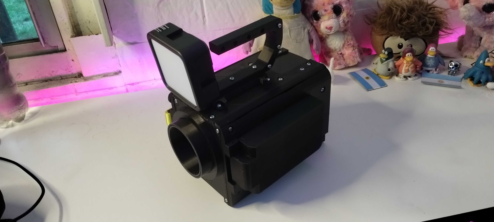
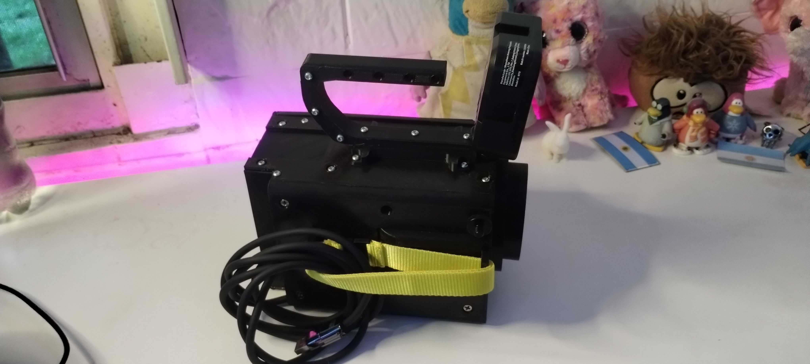
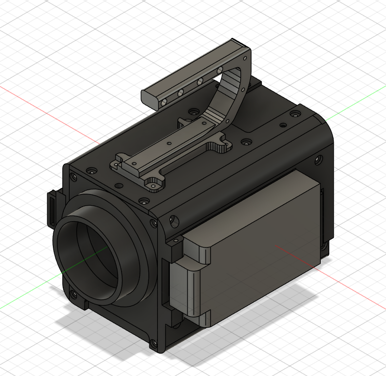

# 🎥 Unicam — V1.1.1

**Unicam** es un sistema de cámara digital completo escrito en **Python**, diseñado específicamente para **Raspberry Pi 5** y módulos de cámara compatibles.
El proyecto permite capturar fotos, grabar video y transmitir en vivo mediante RTSP/SRT, combinando hardware económico con un workflow profesional.

---

## 🎥 Unicam Pro V1





## ✨ Características principales

### 🔵 Modos de funcionamiento
- **📷 Foto:**  
  - Captura **10 fotos** consecutivas a la **máxima resolución disponible** del sensor.  
  - Soporte para **HDR** cuando el sensor lo permita.  
  - Reducción de ruido integrada.  
  - Guardado en formato **YUV420 → JPG**.

- **🎬 Grabación:**  
  - Grabación fluida en **2K 30fps** sin pérdida.  
  - Procesamiento con **reducción de ruido**.  
  - Pipeline optimizado para la Pi 5.
  - Guardado en formato **YUV420 → MP4**.

- **📡 Streaming:**  
  - Transmisión de video a servidores remotos mediante **RTSP** o **SRT**.  
  - Alta Calidad optimizada para baja latencia.  
  - Pensado para streaming o conexión inalámbrica local.

---

## 🖥️ Panel de Control Web
Incluye un servidor web integrado que permite:

- Monitorear el sensor en tiempo real.
- Cambiar configuraciones del sensor (AF, exposición, WB, ISO, resolución, etc.).
- Ajustar calidad y parámetros del stream.
- Configurar WiFi.
- Crear un **hotspot WiFi automáticamente** si no se detecta internet.
- Ver estado del sistema, CPU, temperatura y modos activos. 

Perfecto para controlar la cámara desde un teléfono o una laptop sin cables.

---

## 📺 Interfaz en Pantalla (LCD TFT)
Soporte integrado para:

- Pantalla **480×320 TFT** en modo landscape.
- Soporte para **táctil**.  
- Vista previa de cámara en vivo.
- HUD con modo, FPS, nivel de batería (proximamente).
- Posibilidad de cambiar modos manuales o automaticos funciones desde la pantalla.

---

## 🧩 Hardware compatible

- 🟠 **Raspberry Pi 5 (recomendado — probado en 2GB)**  
- 🟣 **Módulos de cámara CSI**  
  - Probado con **Sony IMX708**, pero debería funcionar con cualquier sensor moderno compatible  
- 🔌 Pantalla TFT 480x320 con táctil  
- 🔋 Botones físicos opcionales (grabación, zoom, menú, etc.)  
- 💡 GPIO para LED de grabación (implementado pero opcional)

---

## 🚀 Instalación

### 1. Clonar el repositorio
```bash
git clone https://github.com/Uni44/unicam.git
cd unicam
````

### 2. Instalar dependencias

```bash
pip install -r requirements.txt
```

### 3. Ejecutar la cámara

```bash
python main.py
```

### 4. Acceder al panel web

Abrí en tu navegador:

```
http://ip-de-tu-pi:8044
```

---

## 📦 Licencia

Este proyecto se distribuye bajo la licencia **MIT**, lo que permite usarlo, modificarlo y redistribuirlo libremente.

---

## 👤 Autor

Proyecto creado por **Uni44**, desarrollado para la cámara **Unicam**.

---