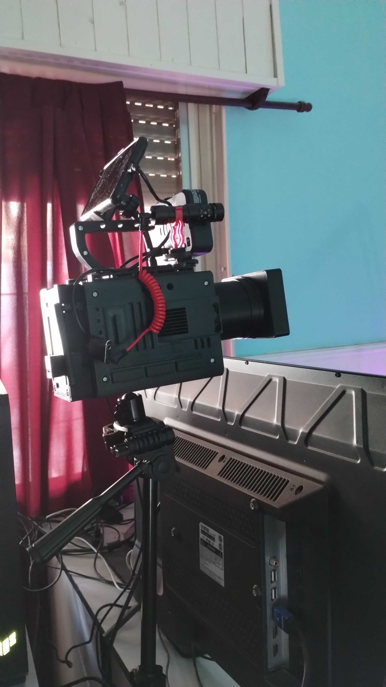

# 🎥 Unicam — V2.3.2

**Unicam** es un sistema de cámara digital completo escrito en **Python**, diseñado específicamente para **Raspberry Pi 5** y módulos de cámara compatibles.
El proyecto permite capturar fotos, grabar video y transmitir en vivo mediante RTSP/SRT, combinando hardware económico con un workflow profesional.

---

## 🎥 Unicam Pro V2




## ✨ Características principales

### 🔵 Modos de funcionamiento
- **📷 Foto:**  
  - Captura **10 fotos** consecutivas a la **máxima resolución disponible** del sensor.  
  - Soporte para **HDR** cuando el sensor lo permita.
  - Soporte para **reducción de ruido** cuando el sensor lo permita.
  - Guardado en formato **YUV420 → JPG**.

- **🎬 Grabación:**  
  - Grabación fluida en **2K 30fps** sin pérdida.  
  - Soporte para **HDR** cuando el sensor lo permita.
  - Soporte para **reducción de ruido** cuando el sensor lo permita.
  - Pipeline optimizado para la Pi 5.
  - Guardado en formato **YUV420 → MP4**.
  - Soporte para **microfonos**.

- **📡 Streaming:**  
  - Transmisión de video a servidores remotos mediante **RTSP** o **SRT**.  
  - Alta Calidad optimizada para baja latencia.
  - Pensado para streaming, conexión inalámbrica **local** incluso **4G** o **5G**.
  - Soporte para **microfonos**.

---

## 🖥️ Panel de Control Web
Incluye un servidor web integrado que permite:

- Monitorear el sensor en tiempo real.
- Cambiar configuraciones del sensor.
- Ajustar calidad y parámetros del stream.
- Configurar WiFi.
- Crea un **hotspot WiFi automáticamente** si no se detecta internet.
- Ver estado del sistema, CPU, temperatura y modos activos. 

Perfecto para controlar la cámara desde un teléfono o una laptop sin cables.

### 📶 Hotspot WiFi
Si la Pi no tiene conexión a internet, crea automáticamente un hotspot:

| Parámetro | Valor |
|-----------|-------|
| **SSID** | `UnicamHotspot` |
| **Contraseña** | `unicam2024` |
| **IP del servidor** | `192.168.4.1:8044` |
| **URL** | `http://192.168.4.1:8044` |

**Cómo conectarse:**
1. En tu teléfono/laptop, busca la red WiFi `Unicam`
2. Conecta con la contraseña `1234567890`
3. Abre el navegador y ve a `http://[IP LOCAL DE LA UNICAM]:8044`
4. Desde aquí puedes configurar la WiFi real o usar la cámara directamente

---

## 📺 Interfaz en Pantalla (LCD TFT)
Soporte integrado para:

- Pantalla **480×320 TFT** en modo landscape.
- Soporte para **táctil**.  
- Vista previa de cámara en vivo.
- HUD con modo, FPS, nivel de batería (proximamente).
- Posibilidad de cambiar modos manuales o automaticos funciones desde la pantalla.

---

## 🧩 Hardware compatible

- 🟠 **Raspberry Pi 5 (recomendado — probado en 2GB)**  
- 🟣 **Módulos de cámara CSI**  
  - Probado con **Sony IMX708**, pero debería funcionar con cualquier sensor moderno compatible  
- 🔌 Pantalla TFT 480x320 con táctil  
- 🔋 Botones físicos opcionales (grabación, zoom, menú, etc.)  
- 💡 GPIO para LED de grabación (implementado pero opcional)
- 🎤 Micrófono USB compatible con ALSA (p. ej., Rode, Shure, Audio-Technica)

---

## 📊 Especificaciones técnicas

### Resoluciones y FPS soportados
| Modo | Resolución | FPS | Codec | Bitrate |
|------|-----------|-----|-------|---------|
| **Foto** | Hasta 4K (sensor-dependiente) | - | YUV420 → JPG | - |
| **Grabación** | 1920×1080 (2K) | 30 | H.264 (x264) | 16Mbps |
| **Stream RTSP** | 1920×1080 (2K) | 30 | H.264 (x264) | 16Mbps |
| **Stream SRT** | 1920×1080 (2K) | 30 | MPEG-TS | 16Mbps |

### Audio
- **Entrada:** Micrófono USB (ALSA `plughw:2,0` por defecto)
- **Frecuencia de muestreo:** 48 kHz
- **Canales:** 1 (mono) o 2 (estéreo, según dispositivo)
- **Codec:** AAC
- **Bitrate:** 96-128 kbps

### Parámetros de video (ajustables)
- **Brillo (Brightness):** -100 a 100
- **Contraste (Contrast):** 0.1 a 10
- **Saturación (Saturation):** 0.1 a 10
- **Nitidez (Sharpness):** -10 a 10
- **Temperatura de color:** 1000-12000K
- **Ganancia analógica:** 1 a 16
- **HDR:** Modo 0 (desactivado) a 3 (máximo)
- **Reducción de ruido:** Modos 0-4

### Puertos utilizados
- **8044:** Servidor web (Panel de Control)
- **8554:** RTSP (streaming)
- **8890:** SRT (streaming)
- **5353:** mDNS (local discovery)

---

## 🚀 Instalación

### 1. Clonar el repositorio
```bash
git clone https://github.com/Uni44/unicam.git
cd unicam
````

### 2. Instalar dependencias

```bash
pip install -r requirements.txt
```

### 3. Ejecutar la cámara

```bash
python main.py
```

### 4. Acceder al panel web

Abrí en tu navegador:

```
http://ip-de-tu-pi:8044
```

---

## 📦 Licencia

Este proyecto se distribuye bajo la licencia **MIT**, lo que permite usarlo, modificarlo y redistribuirlo libremente.

---

## 👤 Autor

Proyecto creado por **Uni44**, desarrollado para la cámara **Unicam**.

---