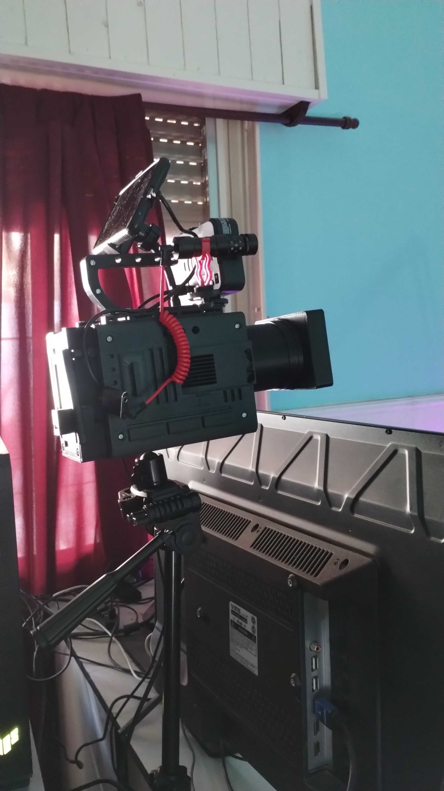
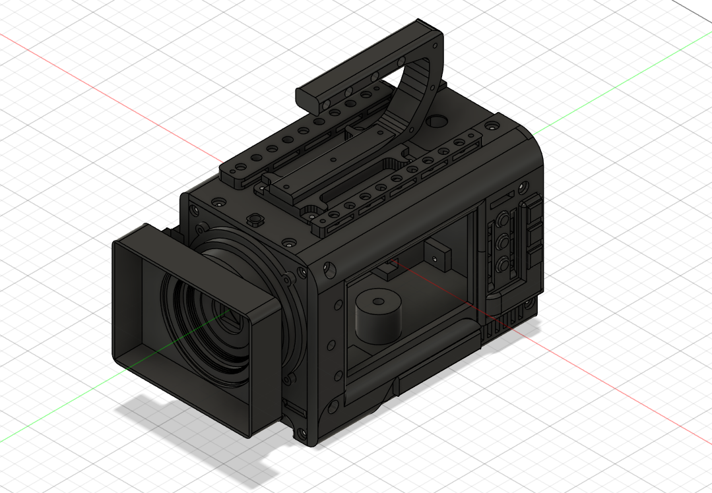
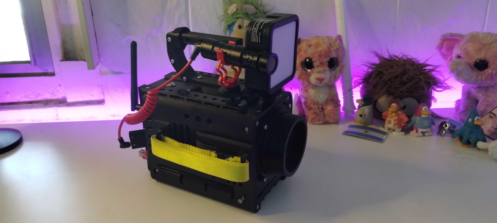

# 🎥 Unicam — V3.0.0

**Unicam** es un sistema de cámara digital basado en **Raspberry Pi 5**, desarrollado en **Python** para fotografía, grabación y streaming profesional utilizando hardware de bajo costo.

Permite capturar fotografías, grabar video, transmitir en vivo mediante **RTSP / SRT / RTMP** y comunicarse con la cámara mediante **intercom**, todo controlado desde una **interfaz web integrada**.





---

# ✨ Características principales

## 📷 Modos de funcionamiento

### Foto

* Captura en alta resolución según el sensor disponible.
* Modo ráfaga para múltiples fotografías consecutivas.
* Conversión y guardado en **YUV420 → JPG**.

### Grabación

* Grabación fluida hasta **1920×1080 a 30 FPS**.
* Pipeline optimizado para Raspberry Pi 5.
* Codificación **H.264**.
* Grabación de audio mediante micrófono USB compatible con ALSA.

### Streaming

Compatible con:

* RTSP
* SRT
* RTMP (opcional)

Características:

* Baja latencia.
* Bitrate configurable.
* Optimizado para redes locales, Ethernet, Wi-Fi y conexiones móviles (4G/5G).

### Óptica y enfoque

* Lente motorizado con control de foco y zoom físico.
* Autofoco continuo con seguimiento de nitidez.
* Ajuste de zoom digital y enfoque parabólico para mantener la imagen nítida al cambiar magnificación.
* Protección del encoder con alertas cuando la resolución, FPS o preset superan límites seguros.

---

# 🌐 Panel de control web

Toda la cámara puede administrarse desde un navegador.

Funciones disponibles:

* Vista previa en vivo.
* Inicio y detención de grabación.
* Captura de fotografías.
* Configuración del sensor.
* Ajustes de calidad de imagen y video.
* Configuración de streaming.
* Gestión de redes Wi-Fi.
* Descarga de fotografías y grabaciones.
* Monitorización del sistema (CPU, RAM, temperatura y almacenamiento).
* Monitorización del nivel del micrófono en tiempo real.
* Alertas visuales de límite del codificador para prevenir sobrecarga de resolución/FPS.
* Intercom para enviar audio desde el navegador hacia la cámara, con TTS y mensajes hablados sintetizados.
* Controles físicos con botones y LEDs para zoom, foco, Start/Stop y estados operativos.
* Overlay HDMI con información clave de la cámara para revisión rápida.
* Zoom digital progresivo cuando el zoom físico llega al límite.

---

# 🎤 Audio

Características:

* Micrófono USB compatible con ALSA.
* Codec AAC.
* Frecuencia de muestreo de 48 kHz.
* Mono o estéreo.
* Bitrate de 96 a 128 kbps.
* Monitor de nivel de audio en tiempo real.
* Mejora de calidad de audio con ajuste de ganancia y mejor rendimiento para micrófonos USB.
* Sistema de intercom para comunicación unidireccional con la cámara mediante audio en tiempo real y TTS.
* Reproducción de mensajes hablados sintetizados para notificaciones, avisos y control por voz.

---

# 📡 Conectividad

## Hotspot automático

Cuando no existe una red Wi-Fi disponible, Unicam crea automáticamente un punto de acceso.

**Configuración predeterminada**

* **SSID:** `Unicam`
* **Contraseña:** `1234567890`
* **Dirección IP:** `192.168.0.20`
* **Panel web:** `http://192.168.0.20:8044`

Esto permite utilizar y configurar la cámara sin necesidad de un router.

---

# 🔌 Hardware compatible

* Raspberry Pi 5 (recomendado).
* Cámaras CSI compatibles (probado con Sony IMX708).
* Micrófonos USB compatibles con ALSA.
* Altavoces USB para función de intercom.
* Lente motorizado con zoom y enfoque automáticos o manuales.
* Autofoco continuo para mantener la imagen nítida durante la grabación o el streaming.
* Iluminación externa.
* Panel de botones físicos con 8 botones y 4 LEDs para zoom, foco, Start/Stop y estado.
* Overlay HDMI con información en tiempo real de la cámara.
* Zoom digital automático cuando el zoom físico alcanza el límite.
* Salida HDMI.

---

# 🔋 Alimentación

* Batería interna integrada.
* Autonomía aproximada de **30 minutos**, dependiendo del uso.

El consumo varía según:

* Grabación.
* Streaming.
* Uso de red.
* Procesamiento del sensor.
* Dispositivos USB conectados.

---

# 📊 Especificaciones técnicas

| Función    | Resolución                            | FPS | Codec | Bitrate      |
| ---------- | ------------------------------------- | --- | ----- | ------------ |
| Fotografía | Hasta la resolución máxima del sensor | —   | JPG   | —            |
| Grabación  | 1920×1080                             | 30  | H.264 | ~16 Mbps     |
| RTSP       | 1920×1080                             | 30  | H.264 | ~16 Mbps     |
| SRT        | 1920×1080                             | 30  | H.264 | ~16 Mbps     |
| RTMP       | 1920×1080                             | 30  | H.264 | Configurable |

---

# ⚙️ Parámetros ajustables

Sensor:

* Brillo
* Contraste
* Saturación
* Nitidez
* Ganancia
* Temperatura de color
* HDR (según el sensor)
* Reducción de ruido

Streaming:

* Resolución
* FPS
* Bitrate
* Codec
* Protocolo

---

# 🌐 Puertos utilizados

| Puerto   | Servicio        |
| -------- | --------------- |
| **8044** | Panel web       |
| **8554** | RTSP            |
| **8890** | SRT             |
| **1935** | RTMP (opcional) |
| **5353** | mDNS            |

---

# 🚀 Instalación

```bash
git clone https://github.com/Uni44/unicam.git
cd unicam
pip install -r requirements.txt
python main.py
```

---

# 🌍 Acceso

Abrir en el navegador:

```
http://IP-DE-LA-RASPBERRY:8044
```

---

# 📄 Licencia

Licencia **MIT**.

Libre para usar, modificar y distribuir.

---

# 👤 Autor

**Uni44**

Proyecto **Unicam**